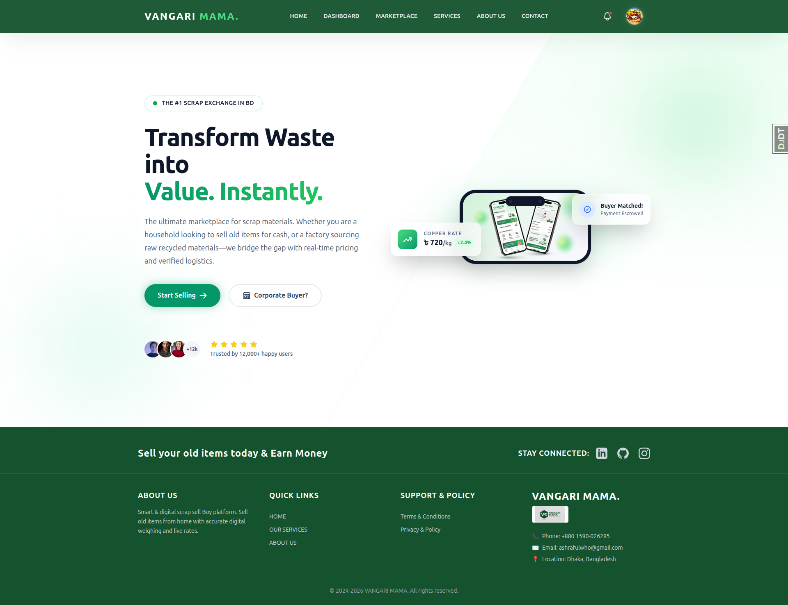
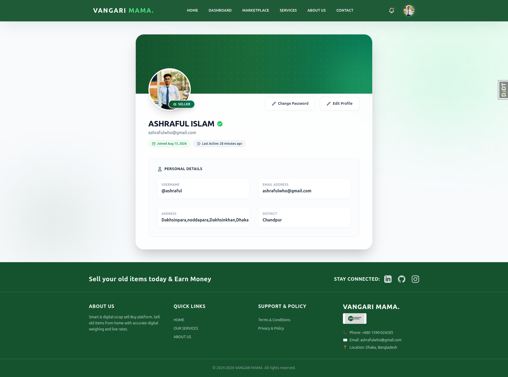
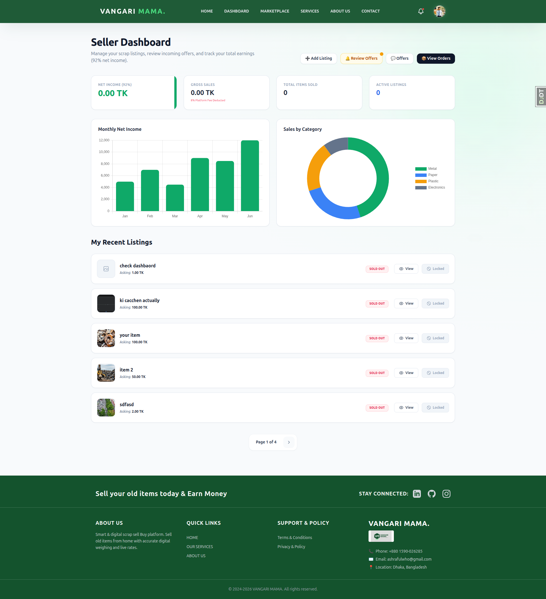
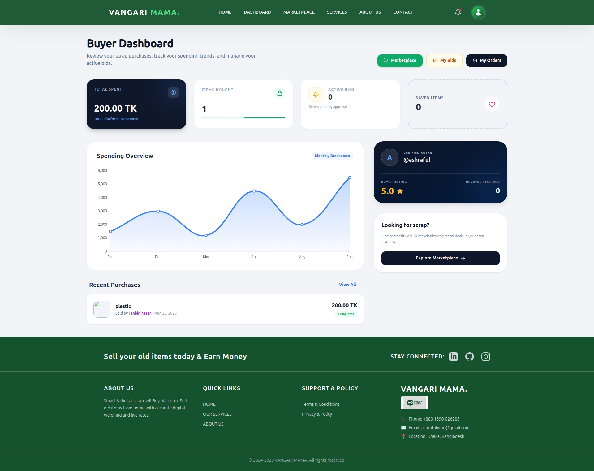

<<<<<<< HEAD
# Vangari Mama

A Django-based online marketplace for buying and selling scrap and recyclable materials, with price negotiation, order management, and role-based dashboards.

## Live Demo

🔗 [https://vangarimama.vercel.app/](vangarimama.vercel.app/)

## Screenshots

| Home | Profile View |
|---|---|
|  |  |

| Dashboard | Buyer Dashboard |
|---|---|
|  |  |

## Features

### Authentication & Users
- Custom user model with role-based accounts — Buyer, Seller, and Admin
- Sign up with email activation link
- Sign in with email or username
- Google OAuth login (django-allauth)
- Password reset via email and in-app password change
- Editable profile — bio, address, district, phone number, profile picture

### Marketplace & Listings
- Sellers can create and edit listings (title, description, price, quantity, category, image)
- Admin-managed categories
- Public marketplace with search and category filtering
- Paginated listing feed
- Listing detail page with total price calculation and seller contact info
- Listing status tracking (Available / Sold Out)

### Bidding & Offers
- Buyers can submit custom price offers on listings
- Sellers can review, accept, or reject incoming offers
- Buyers can track the status of their submitted offers
- Sellers can view all offers received across their listings

### Orders
- Direct purchase flow with automatic order creation
- Platform commission automatically calculated on every completed order
- Order detail view restricted to the buyer and seller involved
- Paginated order history for both buyers and sellers

### Dashboards
- **Admin** — all users, listings, categories, offers, orders, and connected social accounts
- **Seller** — own listings and sales activity
- **Buyer** — recent purchases

### Notifications
- In-app notifications for offer acceptance/rejection
- Paginated notification list
- Mark-as-read on open, with redirect to the related page

### Ratings & Reviews
- Buyers and sellers can rate and review each other after a completed transaction
- Review text is optional

### Other
- Static pages — Home, About Us, Contact Us, Services
- Custom 404 and permission-denied error pages
- Responsive UI built with Tailwind CSS

## Tech Stack

| Category | Technology |
|---|---|
| Backend | Python, Django |
| Database | PostgreSQL |
| Authentication | django-allauth (Google OAuth), Django Auth |
| Frontend | Django Templates, Tailwind CSS |
| Media | Pillow |
| Other | django-phonenumber-field, python-decouple |
=======
# VangariMama  — Trash Collection Marketplace

A Flask-based web application that connects waste generators with local collectors. Users can post trash for pickup, collectors can accept and complete jobs, and everyone can track progress through clean dashboards. The system includes role-based access, authentication, and a points-based rewards model.

## Features

- **User Registration**: Sign up as either a User (waste generator) or Collector
- **Trash Posting**: Users can post trash details with location for collection
- **Collection Management**: Collectors can browse, accept, and complete pickups
- **Reward System**: Earn points based on trash type and quantity
- **Real-time Dashboard**: Track posts, earnings, and collection status
- **Responsive Design**: Works on desktop and mobile devices

## Tech Stack

- **Backend**: Flask (Python)
- **Database**: PostgreSQL with SQLAlchemy
- **Frontend**: Bootstrap 5 with dark theme
- **Authentication**: Flask-Login
- **Icons**: Font Awesome 6

## Local Development Setup (VS Code)

### Prerequisites

- Python 3.11+
- PostgreSQL
- VS Code

### Installation

1. Clone the repository and navigate to the project directory

2. Create a virtual environment:
```bash
python -m venv venv
source venv/bin/activate  # On Windows: venv\Scripts\activate
```

3. Install dependencies:
```bash
pip install -r requirements_for_vscode.txt
```

4. Set up environment variables:
```bash
cp .env.example .env
# Edit .env with your database credentials
```

5. Create PostgreSQL database:
```sql
CREATE DATABASE vangarimama;
```

6. Initialize the database:
```bash
python -c "from app import app, db; app.app_context().push(); db.create_all()"
```

7. Run the application:
```bash
python main.py
```

The application will be available at `http://localhost:5000`

## Usage

1. **Register**: Create an account as User or Collector
2. **Users**: Post trash details with pickup location
3. **Collectors**: Browse available pickups and accept them
4. **Complete**: Mark pickups as completed to award reward points

## Trash Types & Rewards

- **Electronic**: 5 points per unit
- **Metal**: 4 points per unit
- **Glass**: 3 points per unit
- **Plastic**: 2 points per unit
- **Paper**: 1 point per unit
- **Organic**: 1 point per unit
>>>>>>> a4233eb317dcfe1584835a9f2f4d21c25c9e6932

## Project Structure

```
<<<<<<< HEAD
vangari_mama/
├── core/            → Home, About, Contact, Services, error pages
├── users/           → Custom user model, auth, roles, dashboards, profile
├── listings/        → Categories and marketplace listings
├── bids/            → Offer and negotiation system
├── orders/          → Purchases and commission handling
├── notifications/   → In-app notifications
├── reviews/         → Post-transaction ratings and reviews
└── vangari_mama/    → Project settings and root URLs
```

## Getting Started

### Prerequisites
- Python 3.12+
- PostgreSQL
- Node.js and npm

### Installation

1. Clone the repository
```
git clone https://github.com/ashrafulx/vangari-mama.git
cd vangari-mama
```

2. Create and activate a virtual environment
```
python -m venv venv
source venv/bin/activate
```

3. Install Python dependencies
```
pip install -r requirements.txt
```

4. Install frontend dependencies
```
npm install
```

5. Create a `.env` file in the project root
```
SECRET_KEY=
DEBUG=

DB_NAME=
DB_USER=
DB_PASSWORD=
DB_HOST=
DB_PORT=

EMAIL_BACKEND=
EMAIL_HOST=
EMAIL_USE_TLS=
EMAIL_PORT=
EMAIL_HOST_USER=
EMAIL_HOST_PASSWORD=

FRONTEND_URL=
BACKEND_URL=
```

6. Apply migrations
```
python manage.py migrate
```

7. Build Tailwind CSS
```
npm run build:tailwind
```

8. Run the development server
```
python manage.py runserver
```

The app will be available at `http://127.0.0.1:8000`

## User Roles

| Role | Access |
|---|---|
| Buyer | Browse marketplace, make offers, purchase listings, view orders |
| Seller | Create/manage listings, review offers, view sales |
| Admin | Manage categories, users, and monitor all activity |

## License

This project is licensed under the MIT License — see the [LICENSE](LICENSE) file for details.

## Author

**Ashraful Islam**
GitHub: [@ashrafulx](https://github.com/ashrafulx)
=======
/
├── app.py              # Flask app configuration
├── main.py             # Application entry point
├── models.py           # Database models (User, TrashPost)
├── routes.py           # URL routes and view functions
├── templates/          # HTML templates
├── static/            # CSS, JS, and assets
├── requirements_for_vscode.txt  # Python dependencies
└── .env.example       # Environment variables template
```

## Contributing

1. Fork the repository
2. Create a feature branch
3. Make your changes
4. Test thoroughly
5. Submit a pull request

## License

This project is open source and available under the MIT License."# Vangari-Mama" 
>>>>>>> a4233eb317dcfe1584835a9f2f4d21c25c9e6932
